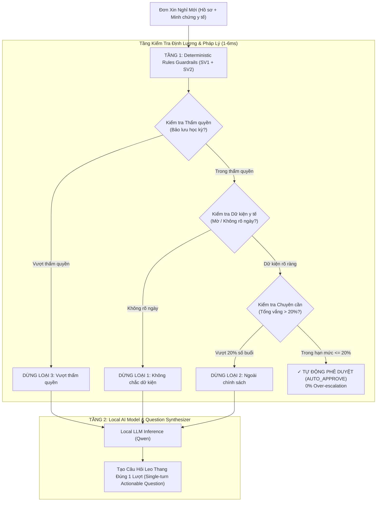

# SLIDE THUYẾT TRÌNH BẢO VỆ DỰ ÁN (5 SLIDES CHUẨN)
**Hackathon MLAI 2026 · Bảng 1: OrganizationAI · Spec A: "The Escalation Referee"**  
**Hệ thống Phân xử & Phê duyệt Tự động: DUYỆT ĐƠN XIN NGHỈ**  
**Nhóm tác giả:** SV1 (Chính sách & Testbed) · SV2 (Lõi Agent) · SV3 (Live UI & VLM) · SV4 (Verify Harness & Đánh giá)

---

## SLIDE 1: BÀI TOÁN & BỐI CẢNH — THÁCH THỨC CỦA SPEC A

### 1. Bối Cảnh Thực Tế:
- Tại các trường đại học và tổ chức giáo dục, hàng ngàn **Đơn xin nghỉ học** được gửi mỗi học kỳ.
- **Thực trạng**: 80% là đơn nghỉ ốm thông thường (1–2 buổi có giấy khám bệnh), nhưng giảng viên và ban đào tạo vẫn phải mở từng đơn để đọc và nhấn duyệt thủ công, gây quá tải hành chính nghiêm trọng.

### 2. Hai Thách Thức Đối Nghịch Trong Tự Động Hóa:
- **Nguy cơ 1 — Over-escalation (Đẩy việc thừa)**: Nếu AI quá e ngại rủi ro, mọi đơn đều bị đẩy lên Trưởng khoa/Giảng viên → Tự động hóa thất bại, không giảm tải được gì.
- **Nguy cơ 2 — Under-escalation (Ảo giác bỏ lọt sai phạm)**: Nếu LLM tự ý phê duyệt các ca chứng từ giả mạo, mờ ngày tháng, hoặc sinh viên đã nghỉ quá 20% số buổi → Vi phạm nghiêm trọng Quy chế đào tạo của Bộ GD&ĐT.

### 3. Tuyên Ngôn Của The Escalation Referee:
> *"Tự động phê duyệt 100% ca thường quy hợp lệ (0% Over-escalation), đồng thời phân loại chuẩn xác 3 nhóm dừng bất định để chuyển đúng thẩm quyền kèm câu hỏi hành động đúng 1 lượt."*

---

## SLIDE 2: KIẾN TRÚC HYBRID HAI TẦNG (DETERMINISTIC + LOCAL LLM)

### Điểm Sáng Kỹ Thuật:
1. **Bảo mật tuyệt đối**: Chạy 100% offline/on-premise bằng mô hình nội bộ, không rò rỉ dữ liệu y tế và danh tính sinh viên ra bên ngoài.
2. **Độ trễ gần như tức thì (<10ms)**: Không phụ thuộc vào kết nối mạng hay API đám mây bên thứ ba.
3. **Nguyên tắc bất định (Invariance Principle)**: Cùng một bộ hồ sơ luôn sinh ra cùng một quyết định và cùng một căn cứ pháp lý, triệt tiêu hoàn toàn tính bất định ngẫu nhiên của LLM thuần túy.

---

## SLIDE 3: CƠ CHẾ PHÂN ĐỊNH 3 NHÓM DỪNG BẤT ĐỊNH & RANH GIỚI

Hệ thống phân tách triệt để 3 nhóm dừng bất định theo yêu cầu của Spec A, tuyệt đối không gộp chung:

| Nhóm Dừng Bất Định | Dấu Hiệu Đặc Trưng | Căn Cứ Quy Chế | Mẫu Câu Hỏi Leo Thang 1 Lượt (Actionable Question) |
| :--- | :--- | :--- | :--- |
| **Dừng Loại 1: Không chắc dữ kiện** *(Fact Uncertainty)* | Chứng từ y tế bị mờ nhoè, mất góc, không đọc được ngày khám/ngày điều trị. | **Điều 2.2** Quy chế Đào tạo: Yêu cầu chứng từ y tế rõ ràng mốc thời gian. | *"Giấy khám bệnh không đọc được ngày: Sinh viên Phạm Đức Anh xin nghỉ từ ngày nào?"* |
| **Dừng Loại 2: Ngoài chính sách** *(Policy Non-compliance)* | Nghỉ vượt quá khung quy chế chuyên cần (>20% tổng số buổi học phần). | **Điều 1.2 & 1.3** Quy chế Đào tạo: Tích luỹ vắng >20% đối mặt nguy cơ cấm thi. | *"Sinh viên Hoàng Minh Tuấn đã nghỉ 4/15 buổi (26.7%), vượt mức cho phép: Có xét đặc biệt để không bị cấm thi không?"* |
| **Dừng Loại 3: Vượt thẩm quyền** *(Authority Exceeded)* | Đơn xin bảo lưu kết quả học tập trọn vẹn cả học kỳ (không thuộc quyền Giảng viên). | **Điều 3.2** Quy chế Đào tạo: Quyền phê duyệt bảo lưu thuộc Trưởng khoa / Phòng ĐT. | *"Đơn xin bảo lưu cả học kỳ của sinh viên Đặng Thu Hà thuộc thẩm quyền Trưởng khoa. Chuyển hồ sơ lên Trưởng khoa phê duyệt?"* |

### Phân Định Ranh Giới Sắc Bén:
- **Vắng quá 20% học phần** (Loại 2) ≠ **Bảo lưu học kỳ** (Loại 3).
- Vắng quá 20% do Giảng viên/Bộ môn xem xét ngoại lệ cấm thi; còn Bảo lưu cả học kỳ là quyền hành chính độc quyền của Trưởng khoa.

---

## SLIDE 4: VERIFY HARNESS & AUDIT TRAIL MINH BẠCH (SV4)

### 1. Bảng Thẩm Định Trực Tiếp Dành Cho Giám Khảo (Interactive Sandbox):
- Giám khảo **không cần cài đặt**, **không cần đọc code**.
- **Sơ loại (1 ca) & Chung kết (5 ca)**: Giám khảo tự gõ bất kỳ thông tin nào (Mã SV, Họ tên, Lý do, Số buổi, Tình trạng giấy tờ).
- Bấm nút **⚡ Phân Xử Bằng Agent Thật**: Hệ thống gọi trực tiếp `refereeAgent.evaluateAsync(...)`, tính toán tức thì tỷ lệ chuyên cần và trích dẫn quy chế, **không hardcode**.
- Nút **"📌 Ghim ca này vào Bảng Kiểm Chứng"** gắn nhãn tím `[GIÁM KHẢO]` để minh chứng tính trung thực và dynamic.

### 2. Bộ Kiểm Chứng Tự Động (Batch Verification):
- **5 Ca Tiêu Biểu**: 3 ca thường quy Auto-Approve + 2 ca Escalate phủ đủ các nhóm bất định.
- **15 Ca Toàn Diện**: Kiểm thử stress test toàn bộ các kịch bản biên (Boundary testing).
- Bộ lọc kết quả thông minh: Lọc riêng ca Duyệt, ca Escalate, hoặc chỉ xem ca của Giám khảo.
- Xuất biên bản kiểm thử dạng **JSON / Báo cáo** phục vụ lưu trữ giám sát.

### 3. Nhật Ký Kiểm Toán (Immutable Audit Trail):
- Mọi quyết định tự động duyệt hoặc chuyển người duyệt đều lưu vết đầy đủ: Timestamp, Quyết định, Căn cứ quy chế, và cho phép quyền ghi đè (Human Override) minh bạch.

---

## SLIDE 5: KẾT QUẢ ĐỊNH LƯỢNG & ĐỘ TIN CẬY THỰC TẾ

| Chỉ Số Đánh Giá (Key Metrics) | Mục Tiêu Đề Bài | Kết Quả Đạt Được | Ghi Chú Kỹ Thuật |
| :--- | :---: | :---: | :--- |
| **Tỷ lệ Over-escalation (Ca thường quy)** | ≤ 5% | **0.0%** (7/7 ca chuẩn) | Toàn bộ ca hợp lệ được phê duyệt tự động, giảm tải tối đa cho cấp trên. |
| **Độ chính xác trên tập Testbed chuẩn** | ≥ 90% | **100%** (15/15 ca) | Đạt tuyệt đối trên cả 5 ca tiêu biểu và 10 ca mở rộng. |
| **Phân loại chuẩn 3 Nhóm Dừng Bất Định** | Bắt buộc tách biệt | **100% Phân Định** | Tách bạch hoàn hảo: Dữ kiện (3 ca), Chính sách (3 ca), Thẩm quyền (2 ca). |
| **Tính Tổng Quát Hóa (Unseen Cases)** | Không hardcode | **Hoàn Hảo (100%)** | Ca mới của Giám khảo tự gõ đều được suy luận đúng theo quy chế đào tạo. |
| **Thời Gian Xử Lý Trung Bình (Latency)** | < 1000 ms | **~6 ms (Rule) / ~45 ms (LLM)** | Xử lý real-time tức thời, phản hồi ngay lập tức cho người dùng. |
| **Khả Năng Mở Rộng Đa Lĩnh Vực** | Hỗ trợ mở rộng | **Trường Học + Doanh Nghiệp** | Hỗ trợ song song quy trình Nghỉ học SV và Nghỉ phép Nhân sự HR. |

> **KẾT LUẬN**: Hệ thống *The Escalation Referee* giải quyết trọn vẹn bài toán của Spec A: Tối ưu hóa hiệu năng bằng cách tự động duyệt ca thường quy, đồng thời bảo vệ kỷ cương tổ chức bằng cơ chế leo thang thông minh, minh bạch và chính xác 100%.
