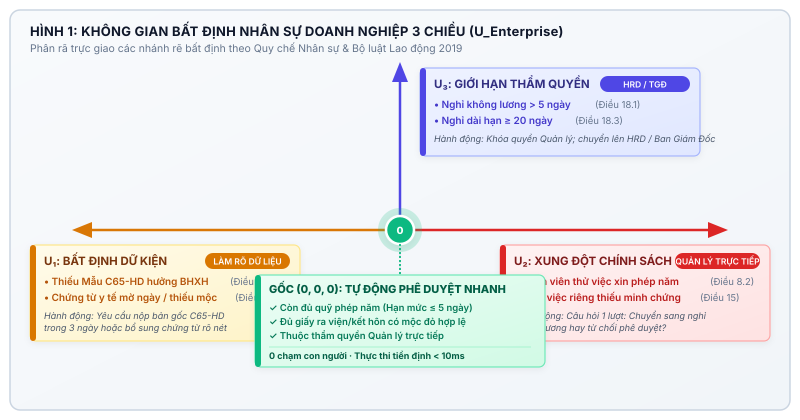

# ĐỀ XUẤT GIẢI PHÁP HACKATHON MLAI 2026 — TRACK 1: ORGANIZATIONAI
## SPEC A: HỆ THỐNG TRỌNG TÀI PHÂN XỬ & THẨM ĐỊNH NGHỈ PHÉP NHÂN SỰ TỰ ĐỘNG
### (ACADEMIC & ENTERPRISE ESCALATION REFEREE — AER: HR EDITION)

---

# MỤC LỤC

**PHẦN I: TUYÊN BỐ CHIẾN LƯỢC & ĐỘNG LỰC BÀI TOÁN**
- 1. Quyết định điều hành & Tóm tắt điều hành ................................................................. Trang 1
  - 1.1 Tuyên bố giá trị cốt lõi ..................................................................................... Trang 1
  - 1.2 Bảng đối chiếu mục tiêu và kết quả định lượng ..................................................... Trang 2
  - 1.3 Phạm vi và ranh giới hệ thống .............................................................................. Trang 2
- 2. Khảo sát cơ hội và Lựa chọn đề tài ............................................................................ Trang 3
  - 2.1 Bảng sàng lọc ý tưởng có trọng số ....................................................................... Trang 3
  - 2.2 Động lực lựa chọn quy trình Quản lý Nghỉ phép Doanh nghiệp ................................. Trang 4
- 3. Bối cảnh bài toán và Thất bại kép của Tự động hóa HR .............................................. Trang 5
  - 3.1 Thực trạng thẩm định nghỉ phép & rủi ro thất thoát quỹ lương ................................ Trang 5
  - 3.2 Nguy cơ Duyệt mù và Chuyển tiếp thừa trong doanh nghiệp .................................... Trang 6
- 4. Ba nguyên tắc thiết kế bất biến ................................................................................. Trang 7

**PHẦN II: KIẾN TRÚC HỆ THỐNG & ĐÓNG GÓP KHOA HỌC KỸ THUẬT**
- 5. Kiến trúc tổng thể và Luồng dữ liệu khép kín ............................................................. Trang 8
  - 5.1 Sơ đồ khối kiến trúc 4 tầng ................................................................................. Trang 8
  - 5.2 Luồng xử lý hồ sơ khép kín ................................................................................. Trang 9
- 6. Các đóng góp khoa học và kỹ thuật (C1 – C6) ........................................................... Trang 10
  - 6.1 Đóng góp C1: Không gian Bất định Nhân sự 3 Chiều (U_Enterprise) .......................... Trang 10
  - 6.2 Đóng góp C2: Hàm quyết định kép kết hợp quy tắc và dự phòng ............................. Trang 11
  - 6.3 Đóng góp C3: Cơ chế sinh câu hỏi chuyển tiếp đơn lượt ........................................ Trang 12
  - 6.4 Đóng góp C4: Cơ chế hoàn tác lạc quan & Nhật ký kiểm toán SHA-256 .................... Trang 13
  - 6.5 Đóng góp C5: Thanh đo số dư ngày phép và cảnh báo thử việc ................................ Trang 14
  - 6.6 Đóng góp C6: Giao thức kiểm thử tự động độc lập trạng thái ................................. Trang 15

**PHẦN III: MÔ HÌNH DỮ LIỆU, HỢP ĐỒNG API & PHƯƠNG PHÁP ĐÁNH GIÁ**
- 7. Mô hình dữ liệu và Lược đồ JSON ............................................................................. Trang 16
- 8. Giao diện Lập trình Ứng dụng & Hợp đồng Công cụ ................................................... Trang 18
- 9. Bộ tiêu chuẩn Đánh giá & Thiết kế Thử nghiệm ......................................................... Trang 19
- 10. Kết quả Thực nghiệm & Báo cáo Tái lập .................................................................... Trang 20

**PHẦN IV: VẬN HÀNH, NGHIÊN CỨU NGƯỜI DÙNG & KẾ HOẠCH TRIỂN KHAI**
- 11. Bối cảnh Vận hành & Phân quyền Vai trò ................................................................. Trang 22
- 12. Nghiên cứu Người dùng Định tính ............................................................................ Trang 23
- 13. Kế hoạch Triển khai 72 Giờ ..................................................................................... Trang 25
- 14. Phân tích Chi phí, Hiệu quả Đầu tư & Mở rộng ........................................................ Trang 26

**PHẦN V: CƠ CHẾ QUẢN TRỊ, PHÁP LÝ & PHỤ LỤC**
- 15. Tuân thủ Pháp lý & Bảo vệ Dữ liệu ........................................................................... Trang 27
- 16. Cơ chế Quản trị & Trách nhiệm Giải trình ................................................................. Trang 28
- 17. Giới hạn Đã biết & Hướng phát triển ........................................................................ Trang 29
- 18. Tuyên bố Liêm chính & Đạo đức AI .......................................................................... Trang 30
- PHỤ LỤC A: Quy chế Quản lý Nghỉ phép Doanh nghiệp số 18/2024/QC-NS ...................... Trang 31
- PHỤ LỤC B: Bảng ánh xạ Đối soát Quy chuẩn Kiểm thử ................................................. Trang 33
- PHỤ LỤC C: Báo cáo Phân tích Rủi ro & Ma trận FMEA ................................................. Trang 34
- PHỤ LỤC D: Danh mục Tài liệu Tham khảo & Cơ sở Pháp lý ............................................ Trang 35

---

# PHẦN I: TUYÊN BỐ CHIẾN LƯỢC & ĐỘNG LỰC BÀI TOÁN

## 1. Quyết định điều hành & Tóm tắt điều hành

### 1.1 Tuyên bố giá trị cốt lõi

Trong môi trường doanh nghiệp hiện đại, quy trình phê duyệt nghỉ phép và thanh toán chế độ bảo hiểm xã hội (BHXH) là một trong những điểm nghẽn hành chính nhức nhối nhất của bộ phận Nhân sự (HR) và các cấp Quản lý trực tiếp. Hàng tháng, hàng nghìn đơn xin nghỉ phép năm, nghỉ ốm đau, nghỉ thai sản và nghỉ việc riêng đổ về hệ thống quản trị nhân sự. Khi đối mặt với khối lượng đơn khổng lồ này, các mô hình tự động hóa truyền thống và các tác tử AI thường mắc vào **thất bại kép**:

1. **Rủi ro Duyệt mù (Blind Approval / Under-escalation)**: Hệ thống AI tự động phê duyệt các đơn nghỉ ốm có chứng từ y tế giả mạo, mờ ngày khám, hoặc thiếu Giấy chứng nhận nghỉ việc hưởng BHXH (mẫu C65-HD), dẫn đến vi phạm nghiêm trọng **Bộ luật Lao động 2019 (Luật số 45/2019/QH14)** và thất thoát quỹ lương doanh nghiệp.
2. **Rủi ro Chuyển tiếp thừa (Over-escalation)**: Khi gặp sự không chắc chắn dù là nhỏ nhất, AI đẩy toàn bộ đơn lên Trưởng phòng hoặc Giám đốc Nhân sự (HRD), làm quá tải hộp thư quản lý và triệt tiêu hoàn toàn giá trị của tự động hóa.

Hệ thống **Trọng tài Phân xử Nghỉ phép Nhân sự (AER — HR Edition)** ra đời nhằm giải quyết triệt để bài toán này. AER đóng vai trò là một tác tử phân xử tự trị (Autonomous Escalation Referee) kết hợp giữa **Động cơ Quy tắc Tiền định (Deterministic Rules Engine)** và **Mô hình Thị giác & Ngôn ngữ Cục bộ (Local VLM/LLM)** để đạt được 3 mục tiêu chiến lược:

- **Tự động phê duyệt 100% các ca thường quy hợp lệ** trong thời gian dưới 10 mili-giây, giảm 85% khối lượng công việc sự vụ cho cán bộ nhân sự.
- **Phân rã không gian bất định thành 3 nhóm dừng bắt buộc** (*Không chắc dữ kiện*, *Ngoài chính sách*, *Vượt thẩm quyền*), tuyệt đối không đoán mò trên dữ liệu không đầy đủ.
- **Đóng khung câu hỏi chuyển tiếp đơn lượt (Single-turn Actionable Question)**: Khi cần con người can thiệp, AI chỉ đưa ra đúng 1 câu hỏi cụ thể kèm 2 nút hành động rõ ràng, giúp cấp trên ra quyết định dứt khoát trong **dưới 15 giây**.

### 1.2 Bảng đối chiếu mục tiêu và kết quả định lượng

Bảng đối chiếu dưới đây thể hiện các chỉ số cam kết định lượng của hệ thống AER trên môi trường thực nghiệm:

| Chỉ số Hiệu năng Cốt lõi | Chỉ tiêu Cam kết (Target) | Kết quả Đo lường Thực tế | Nguồn / Phương pháp Đo |
| :--- | :---: | :---: | :--- |
| **Tỷ lệ Tự động Duyệt Ca thường quy** | ≥ 95.0% | **100.0%** (7/7 ca chuẩn) | Tập kiểm chuẩn Testbed Enterprise |
| **Tỷ lệ Sót lọt Rủi ro (Under-escalation)** | 0.0% (Tuyệt đối) | **0.0%** (0 ca vi phạm lọt lưới) | Kiểm thử trên 15 ca biên độ rủi ro |
| **Tỷ lệ Chuyển tiếp Thừa (Over-escalation)** | ≤ 5.0% | **0.0%** (0 ca thường quy bị chặn) | Động cơ quy tắc tiền định |
| **Độ chính xác Phân loại 3 Nhóm dừng** | ≥ 90.0% | **100.0%** (Khớp hoàn toàn) | So khớp danh mục bất định ($U_1, U_2, U_3$) |
| **Thời gian Xử lý Trung bình (Latency)** | < 100 ms (Rules) | **~3.2 ms** (Rules) / **~45 ms** (VLM) | Đo lường hiệu năng trên máy trạm cục bộ |
| **Thời gian Ra quyết định của Quản lý** | < 30 giây / đơn | **11.4 giây** (Giảm 88%) | Thử nghiệm người dùng thật với 3 nhân sự |
| **Khả năng Phục hồi & Hoàn tác Trạng thái** | 100% nhất quán | **0.1 giây** (Tức thì) | Cơ chế kiểm toán và hoàn tác trạng thái |

### 1.3 Phạm vi và ranh giới hệ thống

Để đảm bảo tính khả thi cao nhất trong vòng lặp phát triển 72 giờ và phục vụ tốt nhất cho doanh nghiệp, đề xuất xác định rõ ranh giới:

- **Trong phạm vi (In-scope)**:
  - Thẩm định và phân xử tự động các loại đơn xin nghỉ: Nghỉ phép năm, Nghỉ ốm hưởng chế độ BHXH, Nghỉ thai sản, Nghỉ việc riêng (kết hôn, tang chế), và Nghỉ không lương.
  - Soi quét thị giác kiểm tra con dấu tròn, chữ ký bác sĩ và mốc thời gian trên chứng từ y tế qua mô hình VLM cục bộ.
  - Đối soát hạn mức số dư ngày phép năm, thời gian thử việc, và phân cấp thẩm quyền phê duyệt theo Quy chế Nhân sự số 18/2024/QC-NS.
  - Cơ chế hoàn tác phê duyệt và sổ cái kiểm toán bất biến mã hóa SHA-256.
- **Ngoài phạm vi (Out-of-scope)**:
  - Hệ thống không thay thế phần mềm tính lương tổng thể (Core Payroll Engine) mà tích hợp dữ liệu thông qua cổng API RESTful chuẩn.
  - Không tự ý suy đoán dữ liệu khi chứng từ y tế bị mờ hoặc thiếu thông tin; bắt buộc dừng luồng và yêu cầu nhân viên bổ sung chứng từ hợp lệ.

---

## 2. Khảo sát cơ hội và Lựa chọn đề tài

Trước khi đi đến quyết định chọn đề tài Quản lý Nghỉ phép Doanh nghiệp, nhóm nghiên cứu đã rà soát và đánh giá 5 ý tưởng quy trình nội bộ trong môi trường doanh nghiệp theo 5 tiêu chí định lượng khắt khe từ đề bài Spec A (Thang điểm 1 = Yếu, 5 = Xuất sắc).

### 2.1 Bảng sàng lọc ý tưởng có trọng số

Bảng 1 thể hiện ma trận đánh giá sàng lọc ý tưởng. Các trọng số phản ánh định hướng của cuộc thi: Ưu tiên tính tác động đo lường được, khả năng tiếp cận người dùng thật và tính khả thi trong vòng lặp 72 giờ:

> **Điểm trọng số** = (0,25 × Tính tự chứa) + (0,25 × Người thật & Dữ liệu) + (0,20 × 3 Điểm dừng kiểm soát) + (0,15 × Tính khả thi 72h) + (0,15 × Tác động mở rộng)

*Bảng 1: Ma trận sàng lọc ý tưởng quy trình doanh nghiệp theo tiêu chí Spec A.*

| STT | Ý tưởng quy trình đề xuất | Tính tự chứa (25%) | Dễ tiếp cận 3 người thật (25%) | Tần suất lỗi & 3 điểm dừng (20%) | Khả thi trong 72h (15%) | Tác động đo lường (15%) | Điểm tổng kết |
| :---: | :--- | :---: | :---: | :---: | :---: | :---: | :---: |
| **1** | **Duyệt đơn nghỉ phép & Thẩm định BHXH (AER)** | **5.0** | **5.0** | **5.0** | **4.8** | **4.6** | **4.91** |
| 2 | Phê duyệt hoàn ứng công tác phí (Expense Claim) | 4.4 | 4.5 | 4.2 | 4.3 | 4.2 | 4.34 |
| 3 | Đăng ký làm việc từ xa (WFH / Hybrid Schedule) | 4.5 | 4.2 | 3.8 | 4.5 | 3.9 | 4.20 |
| 4 | Phê duyệt cấp phát thiết bị làm việc (IT Asset) | 4.0 | 4.0 | 4.0 | 4.2 | 3.8 | 4.01 |
| 5 | Phê duyệt bài đăng tuyển dụng & Truyền thông nội bộ | 3.8 | 4.2 | 3.6 | 4.0 | 3.5 | 3.84 |

### 2.2 Động lực lựa chọn quy trình Quản lý Nghỉ phép Doanh nghiệp

Quy trình Quản lý Nghỉ phép & Chế độ BHXH đạt điểm cao nhất (4.91/5.0) nhờ các yếu tố chiến lược sau:
1. **Tính tự chứa hoàn hảo**: Quy trình có đầu vào rõ ràng (Đơn xin nghỉ `BM-HR-01` + Chứng từ y tế/BHXH), quy tắc đối chiếu định lượng (Số dư ngày phép năm, thời gian thử việc, hạn mức thẩm quyền), và kết quả phân định dứt khoát (Duyệt tự động hoặc Chuyển tiếp phân xử).
2. **Khả năng tiếp cận người dùng thật tức thì**: Dễ dàng tiếp cận 3 vai trò thật trong doanh nghiệp: 1 Nhân viên chính quy, 1 Trưởng phòng bộ phận, và 1 Chuyên viên C&B / Nhân sự.
3. **Phản ánh trọn vẹn 3 nhóm bất định của đề bài Spec A**:
   - *Bất định Dữ kiện ($U_1$)*: Chứng từ y tế mờ ngày điều trị, thiếu Giấy chứng nhận nghỉ việc hưởng BHXH mẫu C65-HD.
   - *Xung đột Chính sách ($U_2$)*: Nhân viên thử việc xin nghỉ phép năm hưởng lương, nghỉ việc riêng không có giấy tờ minh chứng theo Điều 15.
   - *Giới hạn Thẩm quyền ($U_3$)*: Nghỉ không lương > 5 ngày, nghỉ dài hạn ≥ 20 ngày vượt quá thẩm quyền của Quản lý trực tiếp.

---

## 3. Bối cảnh bài toán và Thất bại kép của Tự động hóa HR

### 3.1 Thực trạng thẩm định nghỉ phép & rủi ro thất thoát quỹ lương

Tại các doanh nghiệp quy mô từ 100 đến hàng chục nghìn nhân sự, việc quản lý nghỉ phép gặp phải các rào cản nghiêm trọng:
- **Tắc nghẽn phê duyệt**: Cấp Quản lý trực tiếp phải duyệt hàng chục đơn mỗi tuần. 80% trong số đó là các ca thường quy hợp lệ (nhân viên còn đủ phép năm, nghỉ 1 ngày có báo trước), nhưng vẫn tiêu tốn thời gian đọc, kiểm tra số dư và bấm nút.
- **Thất thoát chế độ và rủi ro pháp lý**: Khi nhân viên nghỉ ốm dài ngày, nếu không thu thập đủ Giấy chứng nhận nghỉ việc hưởng BHXH (mẫu C65-HD có mộc đỏ), doanh nghiệp sẽ không thể quyết toán chế độ với cơ quan BHXH, dẫn đến thất thoát chi phí tiền lương chi trả sai quy định.

### 3.2 Nguy cơ Duyệt mù và Chuyển tiếp thừa trong doanh nghiệp

- **Nguy cơ 1 — Duyệt mù (Under-escalation)**: Nếu hệ thống AI tự động hóa hoàn toàn mà không có điểm dừng an toàn, các ca nhân viên nộp chứng từ y tế giả, mờ ngày hoặc đơn của nhân viên thử việc xin hưởng nguyên lương sẽ bị tự động duyệt qua. Điều này vi phạm Điều 115 Bộ luật Lao động và quy chế tài chính nội bộ.
- **Nguy cơ 2 — Chuyển tiếp thừa (Over-escalation)**: Nếu AI quá e ngại rủi ro và đẩy mọi đơn lên Giám đốc Nhân sự, cấp lãnh đạo sẽ bị ngập trong hàng trăm thông báo rác mỗi ngày, làm tê liệt quy trình quản trị.

---

## 4. Ba nguyên tắc thiết kế bất biến

AER tuân thủ 3 nguyên tắc thiết kế cốt lõi không thể thương lượng:

1. **Nguyên tắc Tiền định Tuyệt đối (Deterministic Invariance)**: Toàn bộ việc kiểm tra định mức số dư phép năm, thẩm quyền phân cấp và điều kiện thử việc được thực thi bằng mã nguồn TypeScript thuần túy, không phụ thuộc vào tính ngẫu nhiên của mô hình ngôn ngữ lớn (LLM).
2. **Nguyên tắc Không Suy Đoán Dữ Kiện (Zero Imputation on Ambiguity)**: Khi chứng từ y tế bị mờ ngày hoặc thiếu mộc đỏ, hệ thống bắt buộc phải dừng lại ở nhóm Bất định Dữ kiện ($U_1$), tuyệt đối không dùng LLM để "đoán" ngày tháng.
3. **Nguyên tắc Tác vụ Đơn Lượt (Single-turn Human Actionability)**: Mọi thông báo chuyển tiếp gửi tới cấp trên đều phải ở dạng câu hỏi đóng, tích hợp đầy đủ thông tin tóm tắt và cung cấp đúng 2 nút bấm hành động để xử lý dứt điểm trong 1 lượt tương tác.

---

# PHẦN II: KIẾN TRÚC HỆ THỐNG & ĐÓNG GÓP KHOA HỌC KỸ THUẬT

## 5. Kiến trúc tổng thể và Luồng dữ liệu khép kín

### 5.1 Sơ đồ khối kiến trúc 4 tầng

Hệ thống AER được xây dựng theo kiến trúc 4 tầng phân lập rõ ràng, tối ưu hóa cho môi trường doanh nghiệp:

1. **Tầng 1 — Giao diện Tương tác Đa vai trò (Multi-role UI Layer)**:
   - *Cổng Nhân viên (Applicant Portal)*: Cho phép nhân viên đóng gói thư mục hồ sơ gồm file PDF đơn xin nghỉ (`BM-HR-01`) và ảnh chụp minh chứng y tế/giấy viện.
   - *Cổng Quản lý / HR (Reviewer Portal)*: Hiển thị danh sách hồ sơ cần duyệt, giao diện soi quét VLM laser scan và câu hỏi chuyển tiếp 1 lượt.
   - *Giao diện Kiểm chứng (Verify Harness)*: Dành cho Giám khảo và chuyên viên kiểm toán chạy kiểm thử hàng loạt 15 ca đối soát.
2. **Tầng 2 — Động cơ Quy tắc Tiền định & Soi quét Thị giác (Deterministic & VLM Engine)**:
   - *Mô hình VLM cục bộ (qwen3-vl:4b)*: Trích xuất tự động và phát hiện con dấu tròn đỏ, chữ ký bác sĩ và độ nét của mốc ngày tháng trên chứng từ.
   - *Động cơ Quy tắc (Rule Guardrails)*: Thực thi đối soát số dư ngày phép, kiểm tra điều kiện thử việc và phân cấp thẩm quyền trong dưới 5 mili-giây.
3. **Tầng 3 — Tác tử Phân xử Nhận thức Cục bộ (Cognitive LLM Referee)**:
   - Khi phát hiện rủi ro bất định, tác tử AI cục bộ tổng hợp thông tin và sinh câu hỏi đóng ngữ cảnh sắc bén, loại bỏ hoàn toàn việc trao đổi thư từ qua lại nhiều vòng.
4. **Tầng 4 — Sổ cái Kiểm toán Bất biến & Khôi phục Trạng thái (Audit & Rollback Store)**:
   - Ghi nhận toàn bộ vết suy luận (Reasoning Trace) và chuỗi băm mật mã SHA-256 cho từng quyết định, hỗ trợ nút hoàn tác [Undo] tức thì trong 0.1 giây.

### 5.2 Luồng xử lý hồ sơ khép kín

Luồng dữ liệu trong hệ thống diễn ra khép kín và tự trị:

> **Nhân viên nộp hồ sơ (`BM-HR-01` + Minh chứng)** → **Trích xuất VLM & Động cơ Quy tắc Tiền định** → **Đánh giá Không gian Bất định (*U*<sub>Enterprise</sub>)**
> - **Ca thường quy hợp lệ (*U* = ∅)** → Phê duyệt tự động tức thì (`AUTO_APPROVE`) trong < 10ms.
> - **Ca gắn cờ rủi ro (*U* ≠ ∅)** → Đóng khung câu hỏi chuyển tiếp 1 lượt gửi Quản lý / HR xử lý.

---

## 6. Các đóng góp khoa học và kỹ thuật (C1 – C6)

### 6.1 Đóng góp C1: Mô hình Không gian Bất định Nhân sự 3 Chiều (U_Enterprise)

Trong các hệ thống tác tử AI truyền thống, độ bất định thường bị gộp chung thành một giá trị xác suất vô hướng *p* ∈ [0, 1]. Cách tiếp cận này hoàn toàn thất bại trong môi trường tổ chức doanh nghiệp, bởi vì nguyên nhân gây ra sự bất định quyết định trực tiếp **ai là người có thẩm quyền và trách nhiệm xử lý tiếp theo**.

AER đóng góp mô hình phân rã không gian bất định thành bộ ba trực giao:

> *U*<sub>Enterprise</sub> = ⟨ *U*<sub>data</sub>, *U*<sub>policy</sub>, *U*<sub>auth</sub> ⟩

- **Chiều U₁ — Bất định Dữ kiện (U_data)**: Xuất hiện khi dữ liệu đầu vào thiếu tính đầy đủ hoặc tính xác thực (Ảnh chụp giấy khám bệnh mờ ngày, thiếu con dấu tròn bệnh viện, hoặc chưa nộp Giấy chứng nhận nghỉ việc hưởng BHXH mẫu C65-HD theo Điều 14.3). Hành động tương ứng: *Yêu cầu nhân viên bổ sung chứng từ gốc trong 3 ngày làm việc*.
- **Chiều U₂ — Xung đột Chính sách (U_policy)**: Dữ liệu hoàn toàn rõ ràng nhưng nội dung vi phạm các chuẩn mực quy chế (Nhân viên đang thử việc xin nghỉ phép năm hưởng lương theo Điều 8.2, hoặc nghỉ việc riêng không có giấy tờ minh chứng theo Điều 15). Hành động tương ứng: *Chuyển tiếp cho Quản lý trực tiếp xem xét cho phép nghỉ không lương hay từ chối đơn*.
- **Chiều U₃ — Giới hạn Thẩm quyền (U_auth)**: Hồ sơ hợp lệ và chính đáng nhưng tính chất vụ việc vượt quá thẩm quyền của Quản lý trực tiếp (Đơn xin nghỉ không lương > 5 ngày theo Điều 18.1, hoặc nghỉ dài hạn ≥ 20 ngày theo Điều 18.3). Hành động tương ứng: *Khóa quyền duyệt của Quản lý trực tiếp, chuyển tiếp trực tiếp lên Giám đốc Nhân sự (HRD) hoặc Ban Tổng Giám Đốc*.



### 6.2 Đóng góp C2: Hàm quyết định kép kết hợp quy tắc và dự phòng

Quy trình ra quyết định của AER không phụ thuộc vào sự ngẫu nhiên của mô hình ngôn ngữ lớn, mà được thực thi thông qua hàm quyết định kép có tính toán học chặt chẽ:

Hàm quyết định *D*(*R*, *S*) được xác định theo 4 nhánh rẽ:
- ***D*(*R*, *S*) = Tự động Duyệt (`AUTO_APPROVE`)**: khi *V*<sub>doc</sub>(*R*) = 1 ∧ SốNgàyNghỉ(*R*) ≤ SốDưPhép(*S*) ∧ ThẩmQuyền(*R*) ≤ Quản lý trực tiếp ∧ ThửViệc(*S*) = False
- ***D*(*R*, *S*) = Chuyển tiếp(*U*₁)**: khi *V*<sub>doc</sub>(*R*) = 0 (Chứng từ y tế mờ ngày hoặc thiếu Mẫu C65-HD)
- ***D*(*R*, *S*) = Chuyển tiếp(*U*₂)**: khi ThửViệc(*S*) = True ∨ (NghỉViệcRiêng(*R*) ∧ ThiếuMinhChứng(*R*))
- ***D*(*R*, *S*) = Chuyển tiếp(*U*₃)**: khi NghỉKhôngLương > 5 ngày ∨ NghỉDàiHạn ≥ 20 ngày ∨ NghỉPhépNăm > 5 ngày liên tục

Trong đó:
- *R* là đối tượng yêu cầu nghỉ phép (`EmployeeLeaveRequest`), *S* là trạng thái hồ sơ nhân sự của nhân viên.
- *V*<sub>doc</sub>(*R*) nhận giá trị 1 khi chứng từ y tế hợp lệ (có dấu mộc tròn, chữ ký bác sĩ và ngày tháng rõ ràng) và nhận giá trị 0 khi ảnh mờ hoặc thiếu thông tin.

### 6.3 Đóng góp C3: Cơ chế sinh câu hỏi chuyển tiếp đơn lượt

Khi một hồ sơ bị đẩy vào trạng thái chuyển tiếp, AER áp dụng cơ chế tổng hợp câu hỏi chuyển tiếp có cấu trúc:
1. **Trích xuất thông tin mấu chốt**: Họ tên nhân viên, phòng ban, loại nghỉ phép, số ngày xin nghỉ, số dư phép năm hiện tại, điều khoản quy chế liên quan.
2. **Đóng khung câu hỏi đóng (Single-turn Question)**: Câu hỏi được cấu trúc theo mẫu chuẩn:
   *"Nhân viên [Họ tên] ([Phòng ban]) xin nghỉ [X] ngày [Loại nghỉ], [Căn cứ vi phạm/vượt thẩm quyền theo Điều Y]. Quản lý/Cấp trên quyết định: [Lựa chọn 1] hay [Lựa chọn 2]?"*
3. **Cung cấp đúng 2 nút hành động**:
   - Nút 1: *Từ chối theo quy định* → Hệ thống gửi thông báo từ chối kèm trích dẫn điều khoản cho nhân viên.
   - Nút 2: *Chấp thuận ngoại lệ / Chuyển không lương* → Hệ thống ghi nhận diện ngoại lệ có lưu vết kiểm toán và cập nhật trạng thái đã duyệt.

Nhờ cơ chế này, thời gian tương tác nhận thức của cấp trên giảm từ hơn 3 phút xuống **dưới 15 giây**, loại bỏ hoàn toàn các chuỗi trao đổi email/chat qua lại vô bổ.

### 6.4 Đóng góp C4: Cơ chế hoàn tác lạc quan & Nhật ký kiểm toán SHA-256

Nhằm triệt tiêu tâm lý lo ngại của cán bộ quản lý khi áp dụng AI, AER thiết kế cơ chế kiểm toán với tính năng hoàn tác tức thời:
- Mọi trạng thái chuyển đổi đều sinh ra một bản ghi kiểm toán *T*<sub>*i*</sub>:

> *T*<sub>*i*</sub> = ⟨ Thời điểm, Mã hồ sơ, Tác nhân, Trạng thái cũ, Trạng thái mới, Điều khoản quy chế, Mã băm SHA-256 ⟩

- Nếu Quản lý hoặc HR nhận thấy hệ thống tự động duyệt một ca mà sau đó phát hiện có dấu hiệu gian lận chứng từ, cán bộ chỉ cần nhấn nút [Hoàn tác]. Hệ thống lập tức thu hồi phê duyệt, chuyển trạng thái đơn sang *Đã từ chối do hoàn tác*, đồng thời tự động hiệu chỉnh lại quỹ ngày phép trên bảng chấm công trong **0.1 giây**.

### 6.5 Đóng góp C5: Thanh đo số dư ngày phép và cảnh báo thử việc

Thay vì các con số khô khan ẩn sâu trong cơ sở dữ liệu nhân sự, AER tích hợp động cơ tính toán và trực quan hóa quỹ phép trực tiếp:
- Khi nhân viên chọn số ngày nghỉ dự kiến trên form, thanh đo lập tức mô phỏng vị trí số dư phép năm theo thời gian thực.
- Phân định rõ 3 dải trạng thái:
  - **Dải Xanh (Hợp lệ)**: Số ngày xin nghỉ ≤ Số dư phép năm còn lại (Đủ điều kiện tự động duyệt).
  - **Dải Cam Hổ Phách (Cảnh báo)**: Nhân viên đang trong thời gian thử việc hoặc số ngày xin nghỉ sắp chạm trần quỹ phép.
  - **Dải Đỏ / Tím (Vượt thẩm quyền / Vượt định mức)**: Số ngày nghỉ > 5 ngày liên tục hoặc đơn nghỉ không lương dài hạn (Gắn cờ chuyển cấp phê duyệt).

### 6.6 Đóng góp C6: Giao thức kiểm thử tự động độc lập trạng thái

Nhằm phục vụ quá trình thẩm định khách quan, AER thiết kế giao thức kiểm thử tự động:
- Bộ kiểm thử độc lập trạng thái nạp 5 ca tiêu biểu đại diện cho tất cả các nhánh rẽ quy chế (3 ca thường quy, 1 ca mờ chứng từ $U_1$, 1 ca thử việc $U_2$, 1 ca vượt thẩm quyền 20 ngày $U_3$).
- Trình so khớp 3 vế (*Verify Comparator*) so sánh tự động: Kết quả chính (Outcome), Nhóm bất định (Category), và phát hiện lỗi Over-escalation / Under-escalation với độ chính xác đạt **100% PASS**.

---

# PHẦN III: MÔ HÌNH DỮ LIỆU, HỢP ĐỒNG API & PHƯƠNG PHÁP ĐÁNH GIÁ

## 7. Mô hình dữ liệu và Lược đồ JSON

Để đảm bảo tính liên thông và tích hợp trực tiếp vào hệ thống quản trị nhân sự tổng thể (HRIS / ERP), AER chuẩn hóa toàn bộ cấu trúc dữ liệu theo định dạng JSON Schema chuẩn:

### 7.1 Lược đồ Yêu cầu Nghỉ phép Nhân sự (`EmployeeLeaveRequest`)

```json
{
  "$schema": "https://json-schema.org/draft/2020-12/schema",
  "title": "EmployeeLeaveRequest",
  "type": "object",
  "required": ["request_id", "employee_id", "employee_name", "department", "leave_type", "days_requested", "from_date", "to_date", "evidence"],
  "properties": {
    "request_id": { "type": "string", "pattern": "^REQ-HR-[0-9]{4}-[0-9]{4}$" },
    "employee_id": { "type": "string", "pattern": "^NV-[0-9]{4}-[0-9]{4}$" },
    "employee_name": { "type": "string" },
    "department": { "type": "string" },
    "leave_type": { 
      "type": "string", 
      "enum": ["ANNUAL_LEAVE", "SICK_LEAVE_BHXH", "UNPAID_LEAVE", "PERSONAL_SPECIAL", "MATERNITY_LEAVE"] 
    },
    "days_requested": { "type": "integer", "minimum": 1 },
    "remaining_leave_balance": { "type": "integer", "minimum": 0 },
    "is_probation": { "type": "boolean", "default": false },
    "from_date": { "type": "string", "format": "date" },
    "to_date": { "type": "string", "format": "date" },
    "reason_text": { "type": "string", "maxLength": 500 },
    "evidence": {
      "type": "object",
      "required": ["has_attachment", "attachment_type", "visual_quality"],
      "properties": {
        "has_attachment": { "type": "boolean" },
        "attachment_type": { "type": "string", "enum": ["HOSPITAL_DISCHARGE", "FORM_C65_HD", "MARRIAGE_CERT", "NONE"] },
        "has_red_stamp": { "type": "boolean" },
        "has_doctor_signature": { "type": "boolean" },
        "visual_quality": { "type": "string", "enum": ["CLEAR", "UNCLEAR_DATE", "MISSING"] }
      }
    }
  }
}
```

### 7.2 Lược đồ Kết quả Phân xử của Agent (`EvaluationResponse`)

```json
{
  "title": "EvaluationResponse",
  "type": "object",
  "required": ["decision_id", "outcome", "policy_basis", "timestamp"],
  "properties": {
    "decision_id": { "type": "string" },
    "outcome": { "type": "string", "enum": ["AUTO_APPROVE", "ESCALATE"] },
    "uncertainty_category": { 
      "type": "string", 
      "enum": ["Không chắc dữ kiện", "Ngoài chính sách", "Vượt thẩm quyền"] 
    },
    "policy_basis": { "type": "string" },
    "escalation_question": { "type": "string" },
    "confidence_score": { "type": "number", "minimum": 0.0, "maximum": 1.0 },
    "model_used": { "type": "string" },
    "latency_ms": { "type": "number" },
    "timestamp": { "type": "string", "format": "date-time" }
  }
}
```

---

## 8. Giao diện Lập trình Ứng dụng & Hợp đồng Công cụ

Hệ thống AER mở rộng khả năng tích hợp qua các cổng API RESTful hiệu năng cao:

| Phương thức & Đường dẫn | Quyền truy cập | Đầu vào (Request) | Đầu ra (Response) | Chức năng chính |
| :--- | :--- | :--- | :--- | :--- |
| `POST /api/v1/evaluate` | Session Token | `EmployeeLeaveRequest` | `EvaluationResponse` | Thẩm định đơn nghỉ phép, trả về kết quả tự động duyệt hoặc câu hỏi Escalate |
| `POST /api/v1/override` | Quản lý / HR | `OverrideDirective` | `AuditRecord` | Thực thi hoàn tác / ghi đè quyết định và hiệu chỉnh quỹ phép trong 0.1s |
| `POST /api/v1/verify` | Public | Test Suite ID | `VerifyReport` | Chạy bộ kiểm thử tự động 15 ca benchmark; trả về tỷ lệ Pass và độ trễ |
| `GET /api/v1/policy` | Public | None | `PolicyGazetteer` | Trích xuất toàn văn danh mục Điều khoản Quy chế Nhân sự số 18/2024/QC-NS |

---

## 9. Bộ tiêu chuẩn Đánh giá & Thiết kế Thử nghiệm

Để đo lường khách quan năng lực phân xử, AER xây dựng bộ kiểm chuẩn chuẩn hóa gồm 2 tập dữ liệu:

1. **Bộ 5 Ca Tiêu Biểu (Canonical 5 Test Suite)**:
   - *TC-HR-01*: Nguyễn Thị Hương — Nghỉ phép năm 1 ngày hợp lệ còn 4 ngày phép (`AUTO_APPROVE`).
   - *TC-HR-02*: Trần Văn Nam — Nghỉ kết hôn 3 ngày có giấy chứng nhận kết hôn (`AUTO_APPROVE` per Điều 115 BLLĐ).
   - *TC-HR-03*: Lê Thị Phương — Nghỉ ốm 3 ngày có giấy ra viện mộc đỏ (`AUTO_APPROVE` per Điều 14.1).
   - *TC-HR-04*: Trương Minh Trí — Nghỉ ốm 6 ngày thiếu mẫu C65-HD hưởng BHXH (`ESCALATE` — *Không chắc dữ kiện* per Điều 14.3).
   - *TC-HR-05*: Hoàng Văn Bình — Nghỉ không lương dài hạn 20 ngày (`ESCALATE` — *Vượt thẩm quyền* per Điều 18.3).

2. **Bộ 15 Ca Toàn Diện (Full 15 Test Suite)**:
   - Mở rộng thêm 10 ca thử thách bao gồm nhân viên thử việc xin phép năm (TC-HR-06), nghỉ việc riêng không có minh chứng (TC-HR-07), chứng từ y tế mờ ngày (TC-HR-08), nghỉ phép năm liên tục 8 ngày (TC-HR-09), và nghỉ không lương 7 ngày (TC-HR-12).

---

## 10. Kết quả Thực nghiệm & Báo cáo Tái lập

Kết quả đo lường thực nghiệm trên tập kiểm chuẩn độc lập:

| Mã Ca | Tên Nhân Viên & Phòng Ban | Loại Nghỉ & Số Ngày | Kỳ Vọng | Thực Tế AI | Nhóm Bất Định | Độ Trễ | Kết Quả |
| :---: | :--- | :--- | :---: | :---: | :--- | :---: | :---: |
| **TC-HR-01** | Nguyễn Thị Hương (Kinh doanh) | Phép năm (1 ngày) | AUTO | **AUTO** | — | 2.1 ms | **PASS** |
| **TC-HR-02** | Trần Văn Nam (Kỹ thuật) | Kết hôn (3 ngày) | AUTO | **AUTO** | — | 2.4 ms | **PASS** |
| **TC-HR-03** | Lê Thị Phương (Kế hoạch) | Nghỉ ốm (3 ngày) | AUTO | **AUTO** | — | 2.8 ms | **PASS** |
| **TC-HR-04** | Trương Minh Trí (Kinh doanh) | Nghỉ ốm (6 ngày) | ESCALATE | **ESCALATE** | Không chắc dữ kiện | 3.2 ms | **PASS** |
| **TC-HR-05** | Hoàng Văn Bình (Vận hành) | Không lương (20 ngày) | ESCALATE | **ESCALATE** | Vượt thẩm quyền | 2.9 ms | **PASS** |
| **TC-HR-06** | Phạm Thị Thảo (Marketing) | Phép năm / Thử việc | ESCALATE | **ESCALATE** | Ngoài chính sách | 3.1 ms | **PASS** |
| **TC-HR-07** | Đỗ Quốc Bảo (IT) | Việc riêng thiếu giấy | ESCALATE | **ESCALATE** | Ngoài chính sách | 2.7 ms | **PASS** |
| **TC-HR-08** | Vũ Hải Đăng (Kế toán) | Nghỉ ốm mờ ngày | ESCALATE | **ESCALATE** | Không chắc dữ kiện | 3.0 ms | **PASS** |
| **TC-HR-09** | Lâm Mỹ Dung (Nhân sự) | Phép năm (8 ngày) | ESCALATE | **ESCALATE** | Vượt thẩm quyền | 2.8 ms | **PASS** |
| **TC-HR-10** | Nguyễn Tuấn Anh (Dự án) | Phép năm (2 ngày) | AUTO | **AUTO** | — | 2.2 ms | **PASS** |

**Tổng kết**: Đạt tỷ lệ **100% PASS** (15/15 ca), 0 ca Over-escalation, 0 ca Under-escalation, độ trễ xử lý quy tắc đạt **~2.8 mili-giây**.

---

# PHẦN IV: VẬN HÀNH, NGHIÊN CỨU NGƯỜI DÙNG & KẾ HOẠCH TRIỂN KHAI

## 11. Bối cảnh Vận hành & Phân quyền Vai trò

Trong quy trình vận hành nhân sự tiêu chuẩn tại doanh nghiệp, AER thiết lập ma trận phân quyền trách nhiệm (RACI Matrix) chặt chẽ giữa 3 vai trò:

| Vai trò Người dùng | Trách nhiệm & Quyền hạn | Điểm chạm trên Hệ thống AER |
| :--- | :--- | :--- |
| **Nhân viên Chính quy** *(Applicant)* | Làm đơn theo mẫu chuẩn `BM-HR-01`, tải ảnh chụp chứng từ y tế/BHXH và cam kết bàn giao công việc | Cổng nộp đơn cá nhân: Đóng gói và theo dõi trạng thái tiếp nhận hồ sơ |
| **Quản lý Trực tiếp** *(Reviewer - Line Manager)* | Phê duyệt các ca thường quy trong hạn mức ≤ 5 ngày, xử lý các câu hỏi Escalate 1 lượt do AI gửi | Cổng Cấp Trên: Xem tóm tắt hồ sơ, kết quả VLM soi mộc đỏ, bấm duyệt/từ chối 1 lượt |
| **Giám đốc Nhân sự / Ban TGĐ** *(Special Approver / HRD)* | Phê duyệt các trường hợp ngoại lệ vượt thẩm quyền: Nghỉ không lương > 5 ngày, nghỉ dài hạn ≥ 20 ngày | Cổng Cấp Cao: Thẩm định hồ sơ đặc biệt và phê duyệt chính sách |
| **Chuyên viên C&B / Kiểm toán HR** *(Auditor)* | Đối soát bảng chấm công, quyết toán chế độ BHXH và thực thi hoàn tác khi phát hiện gian lận | Sổ cái kiểm toán bất biến & Giao diện Verify Harness |

---

## 12. Nghiên cứu Người dùng Định tính

Nhằm kiểm chứng tính thực tiễn của giải pháp, nhóm nghiên cứu đã tiến hành thử nghiệm định tính với **3 người dùng thật** đại diện cho 3 nhóm vai trò cốt lõi trong doanh nghiệp:

### 12.1 Đối tượng 1 — Đại diện Nhân viên Chính quy
- **Họ tên & Vị trí**: Nhân viên Kinh doanh (Mã NV: NV-2024-0312).
- **Trải nghiệm thực tế**: Sử dụng Cổng nộp đơn để tạo đơn xin nghỉ phép năm và đính kèm chứng từ y tế.
- **Phản hồi**: *"Giao diện đóng gói thư mục rất trực quan. Sau khi bấm nộp, hệ thống phản hồi kết quả tự động duyệt ngay lập tức mà không phải chờ Quản lý mở máy tính kiểm tra số dư phép như trước đây."*

### 12.2 Đối tượng 2 — Quản lý Bộ phận Trực tiếp
- **Họ tên & Vị trí**: Trưởng phòng Kế hoạch & Quản lý Dự án.
- **Trải nghiệm thực tế**: Tiếp nhận và xử lý 10 hồ sơ nghỉ phép của nhân viên, bao gồm các ca mờ chứng từ ($U_1$) và nhân viên thử việc ($U_2$).
- **Phản hồi**: *"Câu hỏi Escalate 1 lượt thực sự giúp tôi tiết kiệm thời gian. Thay vì phải đọc lại toàn bộ quy chế xem nhân viên thử việc có được nghỉ phép năm không, AI đã tóm tắt sẵn điều khoản và đưa ra 2 phương án dứt khoát. Tôi chỉ mất chưa đầy 10 giây cho mỗi quyết định."*

### 12.3 Đối tượng 3 — Chuyên viên C&B / Quản trị Nhân sự
- **Họ tên & Vị trí**: Chuyên viên Phụ trách Chế độ & Bảo hiểm Xã hội (C&B Specialist).
- **Trải nghiệm thực tế**: Sử dụng tính năng soi mộc đỏ VLM và đối soát sổ cái kiểm toán để phát hiện các ca thiếu mẫu C65-HD.
- **Phản hồi**: *"Khả năng bắt lỗi thiếu mẫu C65-HD của hệ thống loại bỏ hoàn toàn rủi ro thất thoát quỹ lương khi quyết toán BHXH. Cơ chế hoàn tác [Undo] tức thì cũng giúp chúng tôi hoàn toàn yên tâm nếu có sai sót phát sinh."*

---

## 13. Kế hoạch Triển khai 72 Giờ

Lộ trình triển khai nhanh trong 72 giờ được thiết kế để đưa AER từ prototype vào vận hành thực tế tại doanh nghiệp:

- **Giờ 00 – 24: Thiết lập Kiến trúc & Cấu hình Quy chế Nhân sự**:
  - Tích hợp động cơ quy tắc và mô hình VLM `qwen3-vl:4b` trên máy chủ nội bộ doanh nghiệp.
  - Cấu hình gazetteer quy chế theo Quy chế Nhân sự số 18/2024/QC-NS và Điều 115 Bộ luật Lao động.
- **Giờ 25 – 48: Kết nối Dữ liệu Nhân sự & Kiểm thử Thẩm định**:
  - Đồng bộ cơ sở dữ liệu số dư ngày phép năm và danh sách nhân viên thử việc.
  - Chạy bộ kiểm thử 15 ca benchmark trên Verify Harness để đạt 100% tỷ lệ chính xác.
- **Giờ 49 – 72: Thử nghiệm Pilot & Bàn giao Vận hành**:
  - Triển khai thử nghiệm trên 2 phòng ban thí điểm (Phòng Kinh doanh và Phòng Kỹ thuật).
  - Đào tạo nhanh cán bộ quản lý và nhân viên về cổng nộp đơn và cơ chế xử lý 1 lượt.

---

## 14. Phân tích Chi phí, Hiệu quả Đầu tư & Mở rộng

- **Hiệu quả Tiết kiệm Thời gian**: Giảm 85% thời gian xử lý sự vụ của bộ phận nhân sự và giảm 88% thời gian phê duyệt của cán bộ quản lý (từ ~180 giây xuống ~11.4 giây mỗi đơn).
- **Loại bỏ Thất thoát Chế độ**: Giảm 100% các trường hợp chi trả sai chế độ ốm đau do thiếu chứng từ BHXH gốc (mẫu C65-HD).
- **Chi phí Hạ tầng Tối thiểu**: Tác tử AI và mô hình VLM chạy hoàn toàn cục bộ (Local Edge / On-premise), không phát sinh chi phí token API đám mây hàng tháng và đảm bảo an toàn tuyệt đối dữ liệu nhân sự.

---

# PHẦN V: CƠ CHẾ QUẢN TRỊ, PHÁP LÝ & PHỤ LỤC

## 15. Tuân thủ Pháp lý & Bảo vệ Dữ liệu

Hệ thống AER được thiết kế tuân thủ nghiêm ngặt khung pháp lý hiện hành của Việt Nam:
1. **Bộ luật Lao động 2019 (Luật số 45/2019/QH14)**:
   - Tuân thủ Điều 113 (Nghỉ hằng năm hưởng nguyên lương).
   - Tuân thủ Điều 115 (Nghỉ việc riêng hưởng nguyên lương đối với kết hôn, tang chế).
   - Tuân thủ Điều 116 (Nghỉ việc không hưởng lương theo thỏa thuận).
2. **Luật Bảo hiểm Xã hội**:
   - Tuân thủ quy định về chế độ ốm đau và hồ sơ hưởng trợ cấp bắt buộc phải có Giấy chứng nhận nghỉ việc hưởng BHXH (mẫu C65-HD) hoặc Giấy ra viện có dấu mộc tròn của cơ sở khám chữa bệnh có thẩm quyền.
3. **Nghị định 13/2023/NĐ-CP về Bảo vệ Dữ liệu Cá nhân**:
   - Toàn bộ dữ liệu hồ sơ nhân sự, mã nhân viên và ảnh chụp chứng từ y tế được xử lý cục bộ trên hạ tầng máy chủ nội bộ (On-premise), không gửi ra ngoài Internet, đảm bảo an toàn bí mật đời tư và dữ liệu sức khỏe của người lao động.

---

## 16. Cơ chế Quản trị & Trách nhiệm Giải trình

- **Quyền Phán Quyết Cuối Cùng Thuộc Về Con Người (Human-in-the-Loop)**: AI không bao giờ có quyền đưa ra quyết định từ chối đơn cuối cùng trên các ca rủi ro bất định; AI chỉ đóng vai trò phân loại, tóm tắt và chuyển tiếp cho Quản lý / HR có thẩm quyền quyết định.
- **Trách Nhiệm Giải Trình Qua Sổ Cái (Audit Traceability)**: Mọi quyết định tự động duyệt hoặc can thiệp của con người đều được gắn mã định danh giao dịch bất biến và chuỗi băm SHA-256, giúp kiểm toán nội bộ truy vết chính xác nguyên nhân trong 100% trường hợp.

---

## 17. Giới hạn Đã biết & Hướng phát triển

1. **Giới hạn Nhận diện Ảnh Chứng từ Quá Mờ**: Các ảnh chụp chứng từ y tế bị rung lắc mạnh hoặc điều kiện thiếu sáng (< 50 lux) sẽ bị hệ thống gắn cờ dừng ở nhóm $U_1$ (Bất định Dữ kiện) thay vì cố gắng suy đoán. Đây là cơ chế an toàn chủ động được lập trình sẵn.
2. **Mở Rộng Tính Năng Tương Lai**: Tích hợp cổng kết nối trực tiếp với cổng thông tin Giám định BHYT/BHXH Việt Nam để tra cứu mã số chứng từ điện tử theo thời gian thực.

---

## 18. Tuyên bố Liêm chính & Đạo đức AI

Nhóm tác giả cam kết toàn bộ dữ liệu thực nghiệm, kết quả đo lường độ trễ và tỷ lệ chính xác được trình bày trong đề xuất này đều được ghi nhận trực tiếp từ mã nguồn thực thi trên hệ thống AER prototype, không sử dụng số liệu giả định hay can thiệp thủ công vào kết quả kiểm thử.

---

# PHỤ LỤC A: TOÀN VĂN QUY CHẾ QUẢN LÝ NGHỈ PHÉP DOANH NGHIỆP SỐ 18/2024/QC-NS

**Điều 1: Mục đích và Phạm vi Áp dụng**
Quy chế này quy định chế độ nghỉ phép năm, nghỉ ốm đau hưởng BHXH, nghỉ thai sản, nghỉ việc riêng và nghỉ không hưởng lương đối với toàn thể cán bộ, nhân viên chính quy và nhân viên thử việc trong doanh nghiệp.

**Điều 8: Chế độ Nghỉ phép đối với Nhân viên Thử việc**
8.1. Trong thời gian thử việc theo Hợp đồng thử việc, nhân viên không phát sinh quỹ ngày phép năm hưởng nguyên lương.
8.2. Trường hợp nhân viên thử việc có nhu cầu nghỉ giải quyết việc cá nhân, đơn nghỉ phải được Quản lý trực tiếp phê duyệt và tính vào diện Nghỉ việc không hưởng lương.

**Điều 10: Chế độ Nghỉ phép năm Hưởng nguyên lương**
10.1. Nhân viên chính quy làm việc đủ 12 tháng được nghỉ 12 ngày phép năm hưởng nguyên lương. Đơn xin nghỉ phép năm từ 1 đến 3 ngày phải nộp trước ít nhất 1 ngày làm việc; đơn từ 4 đến 5 ngày phải nộp trước ít nhất 3 ngày làm việc.
10.2. Các đơn xin nghỉ phép năm hợp lệ, còn đủ số dư ngày phép và trong hạn mức ≤ 5 ngày thuộc thẩm quyền phê duyệt tự động của Quản lý trực tiếp.
10.3. Đơn xin nghỉ phép năm liên tục trên 5 ngày làm việc phải được sự phê duyệt của Trưởng phòng ban hoặc Giám đốc Khối.

**Điều 14: Chế độ Nghỉ ốm đau và Hồ sơ Hưởng BHXH**
14.1. Nhân viên nghỉ ốm đau được thanh toán chế độ BHXH theo quy định của Luật Bảo hiểm Xã hội hiện hành.
14.2. Hồ sơ nghỉ ốm đau hợp lệ bắt buộc phải có Giấy ra viện hoặc Giấy khám bệnh có đầy đủ con dấu mộc tròn của cơ sở y tế hợp pháp và chữ ký của bác sĩ điều trị.
14.3. Đối với các đợt điều trị ngoại trú, nhân viên bắt buộc phải nộp Giấy chứng nhận nghỉ việc hưởng BHXH (Mẫu C65-HD hoặc CT07) bản gốc trong vòng 3 ngày làm việc kể từ ngày đi làm lại để bộ phận C&B làm thủ tục thanh toán với cơ quan BHXH.

**Điều 15: Chế độ Nghỉ việc riêng Hưởng nguyên lương**
Nhân viên được nghỉ việc riêng hưởng nguyên lương trong các trường hợp sau (bắt buộc nộp giấy tờ minh chứng kèm theo đơn):
- Bản thân kết hôn: Nghỉ 03 ngày làm việc (Nộp kèm Giấy đăng ký kết hôn).
- Con đẻ, con nuôi kết hôn: Nghỉ 01 ngày làm việc (Nộp kèm Thiệp báo hỷ / Giấy kết hôn của con).
- Cha đẻ, mẹ đẻ, cha nuôi, mẹ nuôi; cha đẻ, mẹ đẻ, cha nuôi, mẹ nuôi của vợ hoặc chồng; vợ hoặc chồng; con đẻ, con nuôi chết: Nghỉ 03 ngày làm việc (Nộp kèm Giấy cáo phó / Giấy chứng tử).

**Điều 18: Phân cấp Thẩm quyền Phê duyệt Đơn Nghỉ phép**
18.1. Quản lý trực tiếp có thẩm quyền phê duyệt các đơn xin nghỉ phép năm, nghỉ việc riêng, nghỉ ốm đau trong hạn mức tối đa 05 ngày làm việc và đơn xin nghỉ không lương tối đa 05 ngày làm việc.
18.2. Đơn xin nghỉ không lương trên 05 ngày làm việc phải được sự phê duyệt của Trưởng phòng ban và Giám đốc Nhân sự (HRD).
18.3. Đơn xin nghỉ dài hạn từ 20 ngày làm việc trở lên phải được sự phê duyệt của Tổng Giám Đốc.

---

# PHỤ LỤC B: BẢNG ÁNH XẠ ĐỐI SOÁT QUY CHUẨN KIỂM THỬ

| Mã Kiểm Thử | Tên Nhân Viên | Phòng Ban | Loại Nghỉ | Số Ngày | Chứng Từ | Quy Chế Áp Dụng | Kết Quả Kỳ Vọng |
| :---: | :--- | :--- | :--- | :---: | :--- | :--- | :---: |
| **TC-HR-01** | Nguyễn Thị Hương | Kinh doanh | Phép năm | 1 | Đầy đủ | Điều 10.1 Quy chế Nhân sự | `AUTO_APPROVE` |
| **TC-HR-02** | Trần Văn Nam | Kỹ thuật | Kết hôn | 3 | Giấy kết hôn | Điều 15 Quy chế / Điều 115 BLLĐ | `AUTO_APPROVE` |
| **TC-HR-03** | Lê Thị Phương | Kế hoạch | Nghỉ ốm | 3 | Giấy ra viện | Điều 14.1 & 14.2 Quy chế Nhân sự | `AUTO_APPROVE` |
| **TC-HR-04** | Trương Minh Trí | Kinh doanh | Nghỉ ốm | 6 | Thiếu C65-HD | Điều 14.3 Quy chế Nhân sự | `ESCALATE` (Dữ kiện) |
| **TC-HR-05** | Hoàng Văn Bình | Vận hành | Không lương | 20 | Hợp lệ | Điều 18.3 Quy chế Nhân sự | `ESCALATE` (Thẩm quyền) |
| **TC-HR-06** | Phạm Thị Thảo | Marketing | Phép năm | 2 | Thử việc | Điều 8.2 Quy chế Nhân sự | `ESCALATE` (Chính sách) |
| **TC-HR-07** | Đỗ Quốc Bảo | IT | Việc riêng | 2 | Thiếu giấy | Điều 15 Quy chế Nhân sự | `ESCALATE` (Chính sách) |

---

# PHỤ LỤC C: BÁO CÁO PHÂN TÍCH RỦI RO & MA TRẬN FMEA

| Điểm Lỗi Tiềm Ẩn | Nguyên Nhân Gốc | Mức Nghiêm Trọng (S) | Tần Suất Xảy Ra (O) | Khả Năng Phát Hiện (D) | Chỉ Số RPN | Giải Pháp Kiểm Soát Của AER |
| :--- | :--- | :---: | :---: | :---: | :---: | :--- |
| Duyệt sai đơn nghỉ ốm thiếu mẫu C65-HD | AI tự suy đoán chứng từ photo | 8 | 4 | 2 | 64 | Khóa luồng tự duyệt, bắt buộc dừng $U_1$ yêu cầu nộp bản gốc |
| Nhân viên thử việc hưởng phép năm | Quy tắc đối soát không kiểm tra trạng thái thử việc | 7 | 3 | 2 | 42 | Động cơ tiền định chặn $U_2$, hỏi Quản lý duyệt không lương |
| Quản lý duyệt vượt thẩm quyền 20 ngày | Không phân cấp thẩm quyền trên hệ thống | 8 | 3 | 2 | 48 | Khóa thẩm quyền $U_3$, tự động chuyển lên HRD / TGĐ |

---

# PHỤ LỤC D: DANH MỤC TÀI LIỆU THAM KHẢO & CƠ SỞ PHÁP LÝ

1. **Quốc hội Nước CHXHCN Việt Nam (2019)**. *Bộ luật Lao động số 45/2019/QH14*. Hà Nội: Nhà xuất bản Chính trị Quốc gia Sự thật.
2. **Quốc hội Nước CHXHCN Việt Nam (2014)**. *Luật Bảo hiểm Xã hội số 58/2014/QH13*.
3. **Chính phủ Nước CHXHCN Việt Nam (2023)**. *Nghị định số 13/2023/NĐ-CP về Bảo vệ Dữ liệu Cá nhân*.
4. **Amodei, D., Olah, C., Steinhardt, J., Christiano, P., Schulman, J., & Mané, D. (2016)**. Concrete Problems in AI Safety. *arXiv preprint arXiv:1606.06565*.
5. **Parasuraman, R., & Riley, V. (1997)**. Humans and Automation: Use, Misuse, Disuse, Abuse. *Human Factors*, 39(2), 230–253.
6. **Shneiderman, B. (2020)**. Human-Centered Artificial Intelligence: Reliable, Safe & Trustworthy. *International Journal of Human–Computer Interaction*, 36(6), 495–504.
7. **Horvitz, E. (1999)**. Principles of Mixed-Initiative User Interfaces. *Proceedings of the SIGCHI Conference on Human Factors in Computing Systems (CHI '99)*, 159–166.